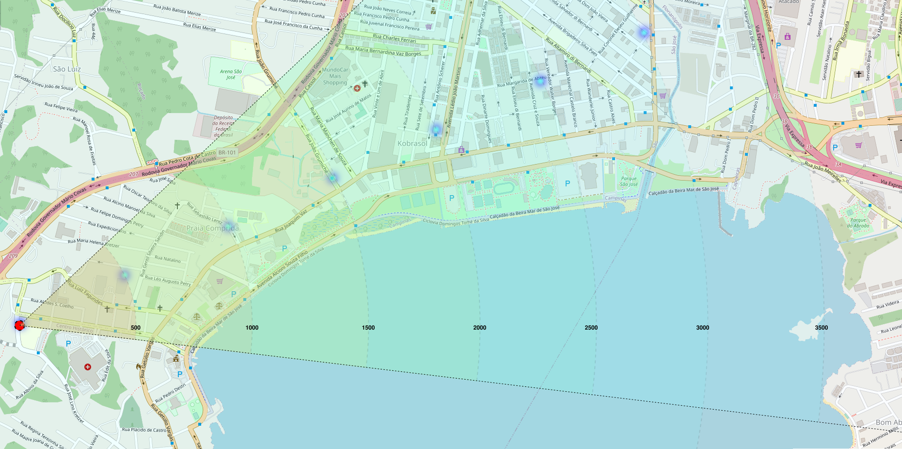

# Campanha de medição LoRaWan com gateway do campus IFSC-SJ

## Introdução

As medições foram conduzidas por meio da utilização do dispositivo [IoT DevKit - LoRaWAN](https://www.robocore.net/tutoriais/iot-devkit-introducao) em uma série de campanhas. O objetivo dessas campanhas era coletar dados na área central de São José, em Santa Catarina, o gateway utilizado estava posicionado no topo da caixa d'água do IFSC-SJ, em uma altura aproximada de 15 metros. Neste repositório, você encontrará os dados coletados, bem como uma análise dos mesmos.

## Fundamentação teórica

### Modelo de Perda de Caminho Log-Distância

Os modelos de propagação teóricos e baseados em medições indicam que a potência média do sinal recebido diminui de forma logarítmica à medida que a distância aumenta, tanto em canais de rádio internos como externos.

 A perda de caminho média em grande escala para uma separação transmissor ($T$) e receptor ($R$),  qualquer $T-R$ é expressa como a função da distância usando um expoente de perda de caminho, $n$. Como na equação abaixo:

$$ \overline{PL}(dB) = \overline{PL}(d_0) + 10n\log_{}\left(\frac{d}{d_0}\right)
$$

onde:
- $\overline{PL}(dB)$ é a perda de caminho estimado em $dB$
- $\overline{PL}(d_0)$ é a perda de caminho na distância de referência em $dB$
- $n$ é expoente de perda de caminho que indica a velocidade com a qual essa perda aumenta com relação à distância e depende do ambiente de propagação específico.
- $d_0$ é a distância de referência próxima determinada pelas medições perto do transmissor.
- $d$ é a distância de separação $T-R$
- As barras na equação indicam a média conjunta de todos os valores possíveis de perda de caminho para determinado valor de $d$.

### Sombreamento log-normal

<!-- a equação anterior não considera o fato de o ruído ambiental ao redor pode ser diferente em dois locais distintos tendo a mesma separação $T-R$, o que leva a sinais medidos diferentes do valor médio da equação anterior -->

A distribuição log-normal descreve os efeitos aleatórios do sombreamento, que ocorrem em vários locais próximos que possuem a separação $T-R$ , mas com diferentes níveis de ruído no caminho de propagação. o sombreamento log-normal implica que os níveis de sinal medidos em uma separação $T-R$ específica seguem uma distribuição gaussiana (normal) em torno da média que depende da distância.
## Medições

Nas tabelas a seguir são apreentados os valores de latitude e longitude dos pontos de medições.
### Coordenadas dos pontos *indoor*

|        local        | distância (m) |   latitude  |  longitude  |
|:-------------------:|:-------------:|:-----------:|:-----------:|
| gateway             |         -     | -27.60795022| -48.63369853|
| Indor-porta-aberta  |         59,71 | -27.608177  | -48.633219  |
| Indor-porta-fechada |         59,71 | -27.6081634 | -48.6338594 |
| auditorio           |         52,29 | -27.608355  | -48.633345  |
| labic-1             |         54,67 | -27.608155  | -48.633180  |
| acesso-quadra       |         57,93 | -27.608341  | -48.633.263 |
| mesa                |          63,5 | -27.608439  | -48.633288  |
| biblioteca          |          82,9 | -27.608604  | -48.633205  |
| labic-2             |         48,35 | -27.6082194 | -48.6333502 |
| frente-ifsc         |        131,77 | -27.608117  | -48.632395  |
| lab-com             |         54,89 | -27.608245  | -48.633300  |

### Coordenadas dos pontos *outdoor*

|        local        | distância (m) |   latitude  |  longitude  |
|:-------------------:|:-------------:|:-----------:|:-----------:|
| frente-bistek       |       1014,65 | -27.606824  | -48.623519  |
| multiuso            |       2285,27 | -27.603.642 | -48.610991  |
| laje-1              |         84,11 | -27.608464  | -48.633043  |
| portaria-frente     |        138,17 | -27.6081508 | -48.6323943 |
| inicio-beira-mar    |          1999 | -27.6039654 | -48.6141063 |
| fim-beira-mar       |          3015 | -27.6026611 | -48.6023764 |
| abraao-beira-mar    |          3580 | -27.611220  | -48.597652  |
| posto-perto-ifsc    |        407,45 | -27.604444  | -48.632901  |
| mundo-car           |          1970 | -27.5958768 | -48.6191918 |
## Simulação dos pontos *outdoor* no *Radio Mobile*

Os pontos das medições *outdoor* foram utilizados para simulação com o *software* *Radio Mobile* e os resultados estão em arquivos html no diretório [radio-mobile](./radio-mobile/).

## Comparação entre dados medidos e simulados e calculados

A tabela a seguir apresenta uma comparação dos valores de Potência Recebida (RSSI) e Perda de caminho (PL) entre o dados medidos, calculados e simulados, considerando somente os pontos *outdoor*.

| Local            | RSSI  medido (dBm) | PL  medido (dB) | RSSI  simulado² (dBm) | PL  simulado² (dB) | RSSI calculado  (N = 2,519) (dBm) | RSSI calculado + desvio¹ |
|------------------|--------------------|-----------------|----------------------|-------------------|-----------------------------|---------------------------------|
| laje-1           | -82,43             | 96,32           | -61,59               | 75,48             | -96,66                      | -96,31                          |
| abrao-beira-mar  | -102,60            | 116,49          | -101,96              | 115,85            | -101,57                     | -97,49                          |
| posto-perto-ifsc | -77,80             | 91,69           | -76,91               | 90,80             | -99,69                      | -90,44                          |
| fim-beira-mar    | -108,05            | 121,94          | -91,91               | 105,80            | -65,45                      | -69,03                          |
| frente-ifsc      | -90,46             | 104,34          | -62,16               | 76,05             | -60,53                      | -81,88                          |
| frente-bistek    | -96,80             | 110,69          | -79,38               | 93,27             | -87,78                      | -84,82                          |
| multiuso         | -100,42            | 114,31          | -88,14               | 102,03            | -95,03                      | -98,35                          |
| mundo-car        | -109,83            | 123,72          | -87,18               | 101,07            | -95,19                      | -108,20                         |
| inicio-beira-mar | -98,87             | 112,76          | -85,98               | 99,87             | -77.8                       | -91,53                          |
> 1. Valores obtidos adicionando uma variável aleatória gaussiana de média 0 e desvio padrão de 10,91 ao valor calculado, então podem mudar a cada execução.
> 2. Simulação realizada no software *Radio Mobile* 

## Parâmetros obtidos
A partir do método de minimização de erro MSE utilizado no código, o valor do parâmetro N obtido está representado na tabela abaixo.

|        | p0 ($dB$) | d0 (m)  | N     |
|--------|------------|---------|-------|
| Outdoor| -77,8      | -80,89  | 2,519 |
> Não houveram dados suficientes para estimar um fator N para os dados Indoor
## Mapa de calor

Com o N estimado pela minimização citada acima, foram obtidos estes valores de RSSI (estes valores utilizam uma variável aleatória gaussiana e podem mudar a cada execução).

| Distância (m) | RSSI ($dB$)          |
|-----------|---------------|
| 1         | -21.42376652  |
| 500       | -89.43267884  |
| 1000      | -97.00470094  |
| 1500      | -101.43679616 |
| 2000      | -104.58218069 |
| 2500      | -107.02225042 |
| 3000      | -109.01609695 |
| 3500      | -110.70196579 |

Abaixo o mapa de calor:

